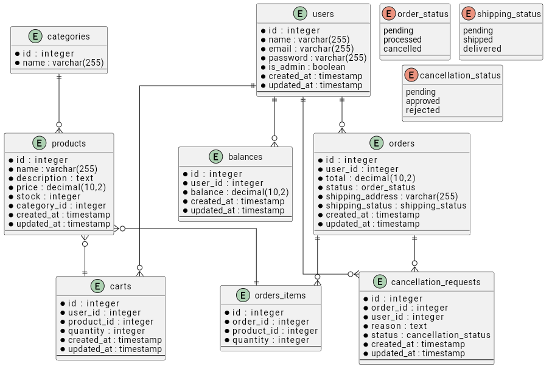

# 📊 Database Documentation

## Introduction
This document provides a comprehensive overview of the database schema used in the E-commerce API. The database is built using PostgreSQL and includes tables for managing users, products, orders, categories, cart items, and more. This guide will help you understand the structure and relationships between different entities in the database.

## Database Schema

### Tables

#### 1. Users
This table stores user information.

| Column         | Type         | Constraints            | Description |
|----------------|--------------|------------------------|-------------|
| `id`           | SERIAL       | PRIMARY KEY            | A unique identifier for each user. |
| `name`         | VARCHAR(255) | NOT NULL               | The name of the user. |
| `email`        | VARCHAR(255) | UNIQUE, NOT NULL       | The email address of the user, which must be unique. |
| `password`     | VARCHAR(255) | NOT NULL               | The hashed password of the user. |
| `is_admin`     | BOOLEAN      | DEFAULT FALSE          | A boolean flag indicating whether the user has administrative privileges. |
| `created_at`   | TIMESTAMP    | DEFAULT CURRENT_TIMESTAMP | The timestamp when the user was created. |
| `updated_at`   | TIMESTAMP    | DEFAULT CURRENT_TIMESTAMP | The timestamp when the user's information was last updated. |

> **Note:** The `users` table is crucial for managing user accounts and authentication.

#### 2. Products
This table stores product details.

| Column         | Type         | Constraints            | Description |
|----------------|--------------|------------------------|-------------|
| `id`           | SERIAL       | PRIMARY KEY            | A unique identifier for each product. |
| `name`         | VARCHAR(255) | NOT NULL               | The name of the product. |
| `description`  | TEXT         |                        | A detailed description of the product. |
| `price`        | DECIMAL(10, 2)| NOT NULL              | The price of the product. |
| `stock`        | INTEGER      | DEFAULT 0              | The available stock quantity of the product. |
| `category_id`  | INTEGER      | FOREIGN KEY REFERENCES categories(id) | A foreign key linking to the `categories` table. |
| `created_at`   | TIMESTAMP    | DEFAULT CURRENT_TIMESTAMP | The timestamp when the product was created. |
| `updated_at`   | TIMESTAMP    | DEFAULT CURRENT_TIMESTAMP | The timestamp when the product's information was last updated. |

> **Note:** The `products` table is essential for managing the inventory of products available for sale.

#### 3. Orders
This table stores order details.

| Column         | Type         | Constraints            | Description |
|----------------|--------------|------------------------|-------------|
| `id`           | SERIAL       | PRIMARY KEY            | A unique identifier for each order. |
| `user_id`      | INTEGER      | FOREIGN KEY REFERENCES users(id) | A foreign key linking to the `users` table, indicating which user placed the order. |
| `total`        | DECIMAL(10, 2)| NOT NULL              | The total amount for the order. |
| `shipping_address` | VARCHAR(255)| NOT NULL            | The address where the order should be shipped. |
| `status`       | ENUM         | ('pending', 'processed', 'cancelled') | The current status of the order. |
| `shipping_status`| ENUM       | ('pending', 'shipped', 'delivered') | The current shipping status of the order. |
| `created_at`   | TIMESTAMP    | DEFAULT CURRENT_TIMESTAMP | The timestamp when the order was created. |
| `updated_at`   | TIMESTAMP    | DEFAULT CURRENT_TIMESTAMP | The timestamp when the order's information was last updated. |

> **Note:** The `orders` table is used to track customer orders and their statuses.

#### 4. Categories
This table stores product categories.

| Column         | Type         | Constraints            | Description |
|----------------|--------------|------------------------|-------------|
| `id`           | SERIAL       | PRIMARY KEY            | A unique identifier for each category. |
| `name`         | VARCHAR(255) | NOT NULL               | The name of the category. |
| `description`  | TEXT         |                        | A description of the category. |

> **Note:** The `categories` table helps to organize products into different groups for easier management and retrieval.

#### 5. Cart Items
This table stores items added to the user's cart.

| Column         | Type         | Constraints            | Description |
|----------------|--------------|------------------------|-------------|
| `id`           | SERIAL       | PRIMARY KEY            | A unique identifier for each cart item. |
| `user_id`      | INTEGER      | FOREIGN KEY REFERENCES users(id) | A foreign key linking to the `users` table, indicating which user added the item to their cart. |
| `product_id`   | INTEGER      | FOREIGN KEY REFERENCES products(id) | A foreign key linking to the `products` table. |
| `quantity`     | INTEGER      | NOT NULL               | The quantity of the product added to the cart. |
| `created_at`   | TIMESTAMP    | DEFAULT CURRENT_TIMESTAMP | The timestamp when the cart item was created. |
| `updated_at`   | TIMESTAMP    | DEFAULT CURRENT_TIMESTAMP | The timestamp when the cart item's information was last updated. |

> **Note:** The `carts` table is used to manage the shopping cart functionality, allowing users to add, update, and remove items before placing an order.

#### 6. Balance
This table stores user balance information.

| Column         | Type         | Constraints            | Description |
|----------------|--------------|------------------------|-------------|
| `id`           | SERIAL       | PRIMARY KEY            | A unique identifier for each balance record. |
| `user_id`      | INTEGER      | FOREIGN KEY REFERENCES users(id) | A foreign key linking to the `users` table. |
| `balance`      | DECIMAL(10, 2)| DEFAULT 0.00          | The current balance of the user. |
| `created_at`   | TIMESTAMP    | DEFAULT CURRENT_TIMESTAMP | The timestamp when the balance record was created. |
| `updated_at`   | TIMESTAMP    | DEFAULT CURRENT_TIMESTAMP | The timestamp when the balance record was last updated. |

> **Note:** The `balances` table keeps track of the financial balance associated with each user.

#### 7. Cancellation Requests
This table stores order cancellation requests.

| Column         | Type         | Constraints            | Description |
|----------------|--------------|------------------------|-------------|
| `id`           | SERIAL       | PRIMARY KEY            | A unique identifier for each cancellation request. |
| `order_id`     | INTEGER      | FOREIGN KEY REFERENCES orders(id) | A foreign key linking to the `orders` table, indicating which order is being requested for cancellation. |
| `user_id`      | INTEGER      | FOREIGN KEY REFERENCES users(id) | A foreign key linking to the `users` table, indicating which user is requesting the cancellation. |
| `reason`       | TEXT         | NOT NULL               | The reason for the cancellation request. |
| `status`       | ENUM         | ('pending', 'approved', 'rejected') | The current status of the cancellation request. |
| `created_at`   | TIMESTAMP    | DEFAULT CURRENT_TIMESTAMP | The timestamp when the cancellation request was created. |
| `updated_at`   | TIMESTAMP    | DEFAULT CURRENT_TIMESTAMP | The timestamp when the cancellation request was last updated. |

> **Note:** The `cancellation_requests` table allows users to request the cancellation of their orders and track the status of these requests.

#### 8. Order Items
This table stores items in an order.

| Column         | Type         | Constraints            | Description |
|----------------|--------------|------------------------|-------------|
| `id`           | SERIAL       | PRIMARY KEY            | A unique identifier for each order item. |
| `order_id`     | INTEGER      | FOREIGN KEY REFERENCES orders(id) | A foreign key linking to the `orders` table, indicating which order the item belongs to. |
| `product_id`   | INTEGER      | FOREIGN KEY REFERENCES products(id) | A foreign key linking to the `products` table. |
| `quantity`     | INTEGER      | NOT NULL               | The quantity of the product in the order. |

> **Note:** The `orders_items` table is used to manage the details of each product included in an order, allowing for a detailed breakdown of order contents.